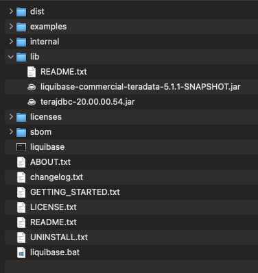

# BTEQ Executor Demo

This directory contains demonstration materials for the Liquibase BTEQ Executor extension. The demos showcase key features that differentiate native BTEQ execution from standard JDBC connections.

## Overview

The BTEQ Executor enables Liquibase to capture complete output from Teradata operations that aren't fully supported through JDBC:

- **Macro Execution Output** - Capture complete result sets from `EXEC macro()` statements (PRIMARY feature not available via JDBC)
- **Query Result Streaming** - Unlimited row capture from SELECT queries and zero-row results from MINUS queries
- **Stored Procedure Output** - Capture result sets from CALL statements
- **Error Visibility** - Complete BTEQ error messages and diagnostic information
- **Native BTEQ Commands** - Support for `.IF`, `.LOGON`, `.QUIT` and other BTEQ-specific functionality

## Demo Contents

| File | Purpose | Status |
|------|---------|--------|
| [liquibase.properties](liquibase.properties) | Configuration template with all BTEQ executor properties | |
| [reset.sh](reset.sh) | Idempotent script to create fresh `bteq_demo` database | |
| [changelogs/scenario-1-macro-output.sql](changelogs/scenario-1-macro-output.sql) | Demonstrates macro execution output capture | Working |
| [changelogs/scenario-2-query-results.sql](changelogs/scenario-2-query-results.sql) | Demonstrates SELECT streaming and MINUS queries | Working |
| ~~[changelogs/scenario-3-stored-procedures.sql](changelogs/scenario-3-stored-procedures.sql)~~ | Demonstrates stored procedure creation and CALL execution | **Blocked** - see [Issue #3](https://github.com/recampbell/bteq-executor/issues/3) |
| [changelogs/scenario-4-rollback.sql](changelogs/scenario-4-rollback.sql) | Demonstrates rollback functionality with tagged changesets | Working |
| [changelogs/scenario-5-audit-logging.sql](changelogs/scenario-5-audit-logging.sql) | Demonstrates audit-quality logging output (elapsed time, row counts, query results) | Working |
| ~~[changelogs/scenario-6-functions.sql](changelogs/scenario-6-functions.sql)~~ | Documents BTEQ limitation with SQL functions | **Known Limitation** - see below |
| ~~[changelogs/scenario-7-triggers.sql](changelogs/scenario-7-triggers.sql)~~ | Documents BTEQ limitation with triggers | **Known Limitation** - see below |
| [changelogs/scenario-8-lob-json-xml.sql](changelogs/scenario-8-lob-json-xml.sql) | Demonstrates CLOB, BLOB, JSON, and XML column support | Working |

Each scenario is **self-contained** and can be run independently in any order after running `reset.sh`.

### Known BTEQ Limitations (Scenarios 6-7)

Scenarios 6 and 7 document **fundamental BTEQ limitations** that cannot be worked around:

| Object Type | BTEQ Inline | `.COMPILE FILE` | Recommendation |
|-------------|-------------|-----------------|----------------|
| Stored Procedure | ❌ Fails | ✅ Works | Use `.COMPILE FILE` (Issue #3) |
| SQL Function | ❌ Fails | ❌ Not supported | **Use JDBC** (remove `runWith:bteq`) |
| Trigger | ❌ Fails | ❌ Not supported | **Use JDBC** (remove `runWith:bteq`) |

**Root cause:** BTEQ parses semicolons as statement terminators at the client level. Compound statements with `BEGIN`/`END` blocks containing semicolons are split incorrectly.

**Documentation reference:** See `docs/bteq-docs/06-bteq-commands.md` (COMPILE command) which states: *"The COMPILE command is used only for SQL (internal) stored procedures."*

For functions and triggers with `BEGIN`/`END` blocks, remove `runWith:bteq` to use JDBC instead.

## Prerequisites

Before running the demos, ensure you have:

- **BTEQ** - Teradata BTEQ command-line tool installed and in PATH
- **Teradata Admin Access** - A Teradata admin user (like `dbc`) to create demo database and user
- **Teradata JDBC Driver** - Download from [Teradata Downloads](https://downloads.teradata.com/download/connectivity/jdbc-driver)
  - Place the JAR file in a known location (e.g., `~/lib/terajdbc.jar`)
  - Add to Liquibase classpath (see below)
- **liquibase-commercial-teradata.jar** - This is the Teradata extension with BTEQ integration.
  - Place the JAR file in the same location as the `teradatajdbc.jar`

- **Java 17+** - Required for Liquibase 4.29.0
- **Liquibase 5.1.0+** - With the BTEQ executor extension jar


### Configure Teradata JDBC Driver

**Option 1: Add to liquibase.properties** (recommended for demo):

Edit [liquibase.properties](liquibase.properties) and update the classpath to include the Teradata JDBC driver:

```properties
classpath=../target/bteq-executor-1.0.0-SNAPSHOT.jar:~/lib/terajdbc.jar
```

**Option 2: Add to Liquibase lib directory**:

```bash
cp ~/lib/terajdbc.jar $LIQUIBASE_HOME/lib/
```

**Option 3: Use command-line classpath**:

```bash
liquibase --classpath=../target/bteq-executor-1.0.0-SNAPSHOT.jar:~/lib/terajdbc.jar update
```

## Quick Start

Follow these two simple steps to run the demos:

### 1. Create Demo Environment

Run the reset script to automatically:
- Create a fresh `bteq_demo` database
- Create a `demo_user` with password `demo_pass`
- Grant necessary permissions
- Update [liquibase.properties](liquibase.properties) with the demo credentials

```bash
./reset.sh
```


### 2. Run Demo Scenarios

Each scenario can be run independently in any order (liquibase.properties is already configured):

```bash
# Scenario 1: Macro output capture
liquibase update --changelog-file=changelogs/scenario-1-macro-output.sql

# Scenario 2: Query result streaming
liquibase update --changelog-file=changelogs/scenario-2-query-results.sql

# Scenario 3: Stored procedure execution
liquibase update --changelog-file=changelogs/scenario-3-stored-procedures.sql

# Scenario 4: Rollback demonstration
liquibase update --changelog-file=changelogs/scenario-4-rollback.sql

# Scenario 5: Audit-quality logging
liquibase update --changelog-file=changelogs/scenario-5-audit-logging.sql

# Scenario 8: LOB, JSON, and XML support
liquibase update --changelog-file=changelogs/scenario-8-lob-json-xml.sql
```

## Demo Scenarios

### Scenario 1: Macro Execution Output Capture

**File**: [changelogs/scenario-1-macro-output.sql](changelogs/scenario-1-macro-output.sql)

**Demonstrates**: Capturing complete result sets from macro execution (PRIMARY feature)

**Key Feature**: JDBC cannot capture output from `EXEC macro()` statements. The BTEQ executor captures the complete result set.

**Run**:
```bash
liquibase update --changelog-file=changelogs/scenario-1-macro-output.sql
```

**Expected Output**:
```
[INFO] Executing changeset: demo:s1-exec-validation-macro
[INFO] Executing with the 'bteq' executor
[INFO] EXEC validate_deployment();
[INFO]
table_name     row_count
-------------  ---------
demo_products          4
demo_orders            0
```

**What It Does**:
1. Creates `demo_products` and `demo_orders` tables
2. Creates a validation macro that returns table row counts
3. Loads sample product data
4. Executes the macro and captures the complete result set
5. Cleans up all objects

### Scenario 2: Query Result Streaming

**File**: [changelogs/scenario-2-query-results.sql](changelogs/scenario-2-query-results.sql)

**Demonstrates**: SELECT query result capture and zero-row MINUS query handling

**Key Features**:
- Unlimited row streaming (no buffer limits)
- Zero-row result capture (critical for backup validation using MINUS queries)
- Multi-row aggregate results

**Run**:
```bash
liquibase update --changelog-file=changelogs/scenario-2-query-results.sql
```

**Expected Output**:
```
[INFO] Executing changeset: demo:s2-select-basic
[INFO] Executing with the 'bteq' executor
[INFO] SELECT item_id, item_name, quantity, category FROM demo_inventory ORDER BY item_id;
[INFO]
item_id  item_name          quantity  category
-------  -----------------  --------  ------------
      1  Laptop                   15  Electronics
      2  Mouse                    50  Electronics
      ...

[INFO] Executing changeset: demo:s2-select-minus-query
[INFO] Executing with the 'bteq' executor
[INFO] (Zero rows returned - backup validation pattern)
```

**What It Does**:
1. Creates `demo_inventory` table
2. Loads 10 sample inventory records
3. Executes basic SELECT with ORDER BY
4. Executes aggregate query with GROUP BY
5. Executes MINUS query (zero rows - demonstrates backup validation pattern)
6. Cleans up all objects

### Scenario 3: Stored Procedure Execution

**File**: [changelogs/scenario-3-stored-procedures.sql](changelogs/scenario-3-stored-procedures.sql)

**Demonstrates**: CALL statement execution and procedure output capture

**Key Feature**: Captures result sets returned by stored procedures, including multi-row results.

**Run**:
```bash
liquibase update --changelog-file=changelogs/scenario-3-stored-procedures.sql
```

**Expected Output**:
```
[INFO] Executing changeset: demo:s3-call-procedure-1
[INFO] Executing with the 'bteq' executor
[INFO] CALL insert_order(101, 'Widget A', 5);
[INFO]
status                         order_id  product_name  quantity
-----------------------------  --------  ------------  --------
Order inserted successfully         101  Widget A             5
```

**What It Does**:
1. Creates `demo_orders` table
2. Creates `insert_order` stored procedure with validation logic
3. Calls procedure to insert first order (captures procedure output)
4. Verifies order was inserted
5. Calls procedure to insert second order
6. Cleans up all objects

### Scenario 4: Rollback Demonstration

**File**: [changelogs/scenario-4-rollback.sql](changelogs/scenario-4-rollback.sql)

**Demonstrates**: Liquibase rollback functionality with BTEQ executor

**Key Features**:
- Tagged changesets for rollback-to-tag
- Rollback-count functionality
- Demonstrates that BTEQ changesets can be rolled back like any other changeset

**Run**:
```bash
# Step 1: Deploy all changesets (creates table, inserts 5 customers)
liquibase update --changelog-file=changelogs/scenario-4-rollback.sql

# Step 2: Verify current state (5 customers)
liquibase rollback-count 0 --changelog-file=changelogs/scenario-4-rollback.sql 2>/dev/null || true
# Or query directly: SELECT * FROM demo_customers;

# Step 3: Rollback last 2 changesets (removes customers 4 and 5, keeps 1-3)
liquibase rollback-count 2 --changelog-file=changelogs/scenario-4-rollback.sql

# Step 4: Re-apply to restore customers 4 and 5
liquibase update --changelog-file=changelogs/scenario-4-rollback.sql

# Step 5: Rollback to 'three-customers' tag (same result as rollback-count 2)
liquibase rollback three-customers --changelog-file=changelogs/scenario-4-rollback.sql

# Step 6: Rollback to 'baseline' tag (keeps only customer 1)
liquibase rollback baseline --changelog-file=changelogs/scenario-4-rollback.sql

# Cleanup: Run reset.sh to drop demo_customers table for next demo run
./reset.sh
```

**What It Does**:
1. Creates `demo_customers` table
2. Inserts 5 customers with tags at strategic points:
   - `baseline` tag after first customer
   - `three-customers` tag after third customer
3. Verifies all 5 customers are present
4. Demonstrates rollback-count and rollback-to-tag

**Note**: Unlike other scenarios, this one does NOT auto-cleanup so you can experiment with rollback. Run `./reset.sh` when done to clean up.

### Scenario 5: Audit-Quality Logging Output

**File**: [changelogs/scenario-5-audit-logging.sql](changelogs/scenario-5-audit-logging.sql)

**Demonstrates**: Rich logging output for audit/compliance requirements

**Key Features**:
- Elapsed time per statement (`*** Total elapsed time was N seconds.`)
- Row counts for DML (`*** Insert completed. 5 rows added.`)
- DDL success messages (`*** Table has been created.`)
- Query results with column headers and data

**Run**:
```bash
liquibase update --changelog-file=changelogs/scenario-5-audit-logging.sql
```

**Expected Output**:
```
*** Table has been created.
*** Total elapsed time was 1 second.

*** Insert completed. 5 rows added.
*** Total elapsed time was 1 second.

*** Update completed. 4 rows changed.
*** Total elapsed time was 1 second.

*** Query completed. 5 rows found. 4 columns returned.
Operation              Records Processed    Status         Date
--------------------  -------------------  ------------  ----------
CUSTOMER_LOAD                      150000  VERIFIED      2026-01-19
...

*** Table has been dropped.
```

**What It Does**:
1. Creates `demo_audit` table with audit columns
2. Inserts 5 audit records showing various operations
3. Updates records based on criteria (shows row counts)
4. Runs SELECT queries (shows results with headers and data)
5. Runs aggregate query with GROUP BY
6. Cleans up by dropping the table

**Customer Value**: This scenario proves the BTEQ executor captures all the logging detail that DBAs require for audit trails - execution time, success/failure status, row counts, and actual query data.

### Scenario 8: LOB, JSON, and XML Column Support

**File**: [changelogs/scenario-8-lob-json-xml.sql](changelogs/scenario-8-lob-json-xml.sql)

**Demonstrates**: Working with Teradata LOB types (CLOB, BLOB, JSON, XML) through BTEQ

**Key Features**:
- CLOB for large text documents
- JSON with NEW JSON() constructor (Teradata 16.20+)
- BLOB with hex literal format (`'hexstring'XB`)
- XML with string literal auto-parsing

**Run**:
```bash
liquibase update --changelog-file=changelogs/scenario-8-lob-json-xml.sql
```

**Expected Output**:
```
*** Table has been created.
*** Insert completed. 3 rows added.
...
doc_id  doc_name   content_preview
------  ---------  ------------------------------------------------
     1  README     This is a sample document stored as a CLOB...
     2  LICENSE    MIT License - Permission is hereby granted...
     3  CHANGELOG  Version 1.0.0 - Initial release with LOB...
```

**What It Does**:
1. Creates four tables with different LOB column types (CLOB, JSON, BLOB, XML)
2. Inserts sample documents into CLOB table
3. Inserts JSON configuration data using NEW JSON() constructor
4. Inserts binary data using BLOB hex literal format
5. Inserts XML metadata
6. Runs verification queries showing data was stored correctly
7. Cleans up all objects

**Teradata Syntax Notes**:
- **JSON**: Use `NEW JSON('{"key":"value"}')` constructor (Teradata 16.20+)
- **BLOB**: Use `'hexstring'XB` format (e.g., `'48656C6C6F'XB` = "Hello")
- **XML**: String literals are auto-parsed; query with `XMLSERIALIZE()` not `CAST()`
- **Size limit**: Inline string literals limited to 31,000 characters. For larger LOBs, use JDBC or external files.

## Configuration Options

All BTEQ executor properties use the `liquibase.bteq.*` namespace:

| Property | Default | Description |
|----------|---------|-------------|
| `liquibase.bteq.path` | `bteq` (from PATH) | Path to BTEQ executable |
| `liquibase.bteq.timeout` | `-1` (disabled) | Execution timeout in seconds |
| `liquibase.bteq.keep.temp` | `false` | Retain temp scripts for debugging (credentials redacted) |
| `liquibase.bteq.keep.temp.path` | System temp dir | Directory for retained scripts |
| `liquibase.bteq.keep.temp.name` | `bteq-debug` | Filename prefix for retained scripts |
| `liquibase.bteq.args` | (none) | Additional BTEQ command-line arguments |
| `liquibase.bteq.charset` | From JDBC URL | Character set override |
| `liquibase.bteq.logfile` | (none) | BTEQ session log file path |

Configure these in [liquibase.properties](liquibase.properties), via environment variables (`LIQUIBASE_BTEQ_PATH`), or command-line arguments.

## Troubleshooting

### BTEQ not found

**Error**: `ERROR: BTEQ executable not found in PATH`

**Solution**: Install BTEQ and ensure it's in your PATH, or configure `liquibase.bteq.path` in liquibase.properties:
```properties
liquibase.bteq.path=/opt/teradata/client/bin/bteq
```

### Connection errors

**Error**: `ERROR: Cannot connect to Teradata at localhost:1025`

**Solution**: Verify your connection details in liquibase.properties:
- Check hostname/IP address
- Verify DBS_PORT (default Teradata port is 1025)
- Test connectivity: `telnet hostname 1025`

### Authentication failures

**Error**: `*** Logon Failed ***`

**Solutions**:
- Verify username and password are correct
- Check user has necessary permissions (CREATE DATABASE, CREATE TABLE, etc.)

### Database doesn't exist

**Error**: Database `bteq_demo` doesn't exist when running scenarios

**Solution**: Run `./reset.sh` first to create the database and demo user. The scenarios expect an empty `bteq_demo` database with a properly configured demo user.

### Changesets already executed

**Error**: Changesets have already been executed

**Solutions**:
- Run `./reset.sh` to create a fresh database (drops and recreates `bteq_demo`)
- Or manually clear the DATABASECHANGELOG table:
  ```bash
  ./reset.sh  # Simplest approach
  ```

### Permissions errors

**Error**: User lacks necessary permissions

**Solution**: The demo user created by `reset.sh` should have all necessary permissions on the `bteq_demo` database. If you're using custom credentials, ensure the user has:
- CREATE TABLE
- CREATE MACRO
- CREATE PROCEDURE
- DROP TABLE/MACRO/PROCEDURE
- SELECT/INSERT/UPDATE/DELETE on tables in `bteq_demo`

The admin user (default: `dbc`) needs these permissions to run `reset.sh`:
- CREATE DATABASE
- CREATE USER
- GRANT privileges

## JDBC vs BTEQ Comparison

| Feature | JDBC Executor | BTEQ Executor |
|---------|---------------|---------------|
| Macro output capture | ❌ No | ✅ Yes |
| SELECT result capture | ⚠️ Limited (buffers) | ✅ Full (unlimited streaming) |
| MINUS query zero rows | ⚠️ May not capture | ✅ Captures |
| Stored procedure output | ⚠️ Limited | ✅ Full |
| BTEQ commands (`.IF`, `.QUIT`) | ❌ No | ✅ Yes |
| Error diagnostics | ⚠️ JDBC errors only | ✅ Complete BTEQ error messages |
| Authentication methods | ⚠️ Limited | ✅ TD2 (LDAP/Kerberos planned) |

**When to use BTEQ executor**:
- Macro execution (EXEC statements) - **REQUIRED** for output capture
- Backup validation using MINUS queries with zero rows
- Complex stored procedure result sets
- When you need complete BTEQ error messages
- Scripts with native BTEQ commands

**When JDBC is sufficient**:
- Simple DDL (CREATE, ALTER, DROP)
- Simple DML (INSERT, UPDATE, DELETE)
- When you don't need to capture query output

## Next Steps

### Customize for Your Environment

The `reset.sh` script automatically configures liquibase.properties with demo credentials. To customize:

1. **Use environment variables** with reset.sh (recommended):
   ```bash
   TD_HOST=my-server DEMO_USER=my_user DEMO_PASSWORD=my_pass ./reset.sh
   ```

2. **Manually edit liquibase.properties** after running reset.sh:
   - **Connection settings**: Update `url` for your Teradata server
   - **Debug mode**: Set `liquibase.bteq.keep.temp=true` to inspect generated scripts
   - **Timeout**: Set `liquibase.bteq.timeout=300` (5 minutes) if needed

### Create Your Own Scenarios

Use the demo scenarios as templates:

1. Copy a scenario file: `cp changelogs/scenario-1-macro-output.sql changelogs/my-scenario.sql`
2. Modify changesets for your use case
3. Keep the self-contained pattern (CREATE → USE → DROP)
4. Use unique changeset IDs (prefix with your scenario code)
5. Run independently: `liquibase update --changelog-file=changelogs/my-scenario.sql`

### Integration with CI/CD

The BTEQ executor works seamlessly in CI/CD pipelines:

```yaml
# Example GitHub Actions workflow
- name: Deploy to Teradata
  env:
    # Map secrets to Liquibase environment variables
    LIQUIBASE_COMMAND_URL: "jdbc:teradata://${{ secrets.TD_HOST }}/DATABASE=mydb,DBS_PORT=1025"
    LIQUIBASE_COMMAND_USERNAME: ${{ secrets.TD_USER }}
    LIQUIBASE_COMMAND_PASSWORD: ${{ secrets.TD_PASSWORD }}
  run: |
    liquibase update --changelog-file=db/changelog-master.sql
```

### Learn More

- [BTEQ Executor Documentation](../docs/README.md) - Complete reference
- [BTEQ Commands Reference](../docs/bteq/COMMANDS.md) - Native BTEQ command syntax
- [Error Handling Guide](../docs/bteq/ERROR_HANDLING.md) - Error codes and troubleshooting
- [Java Style Guide](../docs/JAVA_STYLE_GUIDE.md) - For contributing to the extension
